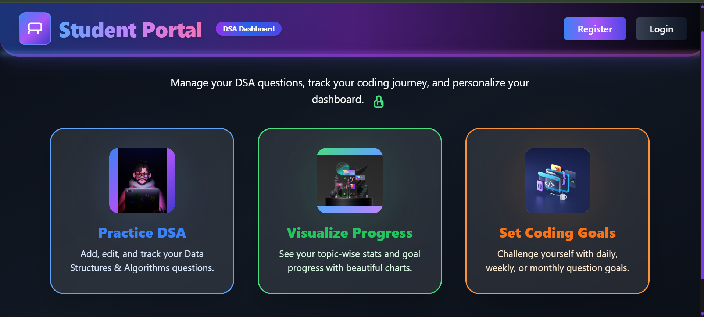
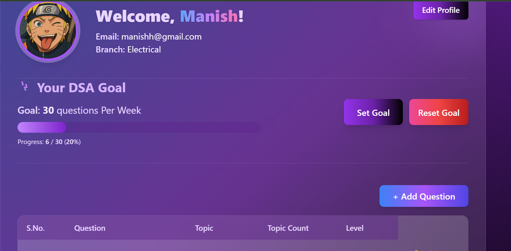

# Algofy: DSA Problem Tracking & Goal Setting
## About the Project

Algofy is a full-stack web application designed to help Data Structures and Algorithms (DSA) enthusiasts track their problem-solving progress across various platforms and set personal goals. Whether you're preparing for interviews, improving your coding skills, or just want to stay consistent, Algofy provides a streamlined way to log solved questions and monitor your daily, weekly, or monthly targets.

This project aims to provide a simple yet effective tool for consistency and motivation in your DSA journey.

## Features

* **Track Solved Questions:** Easily record details of DSA problems solved (e.g., question name, platform, date solved).
* **Set Custom Goals:** Define daily, weekly, or monthly targets for the number of questions you aim to solve.
* **Progress Monitoring:** View your progress against set goals to stay motivated and identify areas for improvement.
* **User-Friendly Interface:** An intuitive web interface for seamless interaction.

## Tech Stack

* **Backend:**
    * [Node.js](https://nodejs.org/): JavaScript runtime
    * [Express.js](https://expressjs.com/): Web application framework for Node.js
* **Database:**
    * [MongoDB]( ): Powerful, open-source relational database
* **Frontend:**
    * EJS
    * Tailwind
    * JavaScript

## Getting Started

To get a local copy up and running, follow these simple steps.

### Prerequisites

Before you begin, ensure you have the following installed:

* [Node.js](https://nodejs.org/en/download/) (LTS recommended)
* [npm](https://www.npmjs.com/get-npm) (Node Package Manager, comes with Node.js)
* [MongoDB]()

### Installation

1.  **Clone the repository:**
    ```bash
    git clone [https://github.com/your-username/algofy.git](https://github.com/your-username/algofy.git)
    cd algofy
    ```

2.  **Install NPM packages:**
    ```bash
    npm install
    ```

### Running the Application

1.  **Start the server:**
    ```bash
    npm start
    ```
    or if you have a dev script:
    ```bash
    npm run dev
    ```

2.  The application will be running at `http://localhost:3000` (or whatever `PORT` you configured in `.env`).

## Usage

Navigate to `http://localhost:3000` in your web browser.

* **Homepage:** A brief overview of your progress and options.
  

* **Profile:**
  Visit the "Goals" section to define your daily, weekly, or monthly targets.
  
## Project Structure
```
├── public/                 # Static assets (CSS, JS, images) for the frontend
│   ├── css/
│   │   └── style.css
│   └── js/
│       └── script.js
├── views/                  # Server-side templates (e.g., .ejs, .pug files)
│   ├── index.ejs           # Example: Homepage template
│   └── partials/           # Example: Common reusable parts
├── app.js                  # Main Express.js application file (server entry point)
├── db.js                   # Database connection and query functions
├── package.json            # Project metadata and dependencies
├── package-lock.json       # npm dependency tree lock file
└── .env                    # Environment variables (local config, NOT committed to Git!)
└── README.md               # This file
```
## Contributing

Contributions are welcome! If you have suggestions for improvements or new features, please feel free to:

1.  Fork the repository
2.  Create your feature branch (`git checkout -b feature/AmazingFeature`)
3.  Commit your changes (`git commit -m 'Add some AmazingFeature'`)
4.  Push to the branch (`git push origin feature/AmazingFeature`)
5.  Open a Pull Request

## Contact

Manish - (mailto:my675890@gmail.com)
Project Link: [https://github.com/maniishh/algofy](https://github.com/maniishh/algofy)

## Acknowledgments

* [Express.js](https://expressjs.com/)

 
